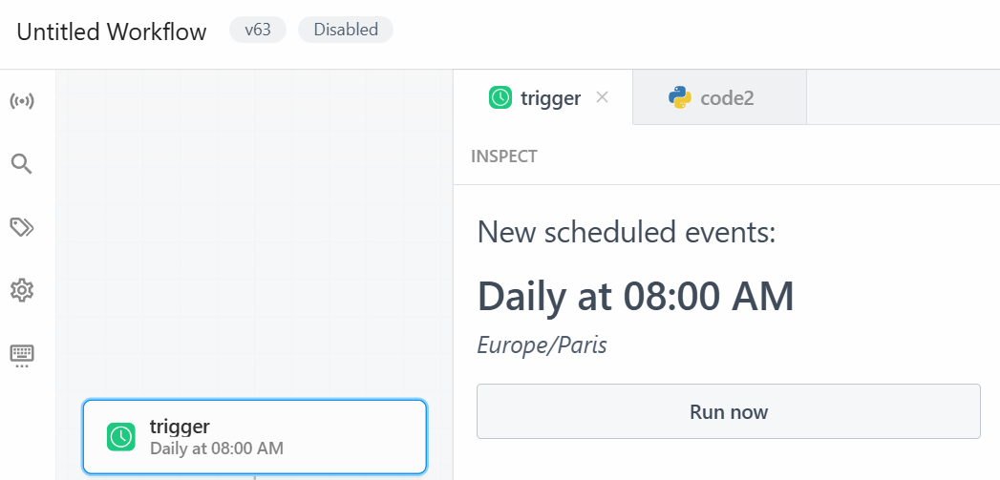

# Weather Newsletter
 
This project first uses a [Weather API](functions/Wetter_checken.py) to retrieve current weather data, and then leverages an [AI API](functions/Wetter_AI.py) to generate a personalized weather newsletter. The final message is [sent](functions/Email_senden.py) to all email addresses listed in the [dictionary](functions/Abbonennten.py).
    
Here’s an example of the email that will be sent:

  

When you want to automize the code you can use a workflow automation platform like Pipedream to automaticly trigger the newsletter every day to a specific time.

  
  

# How?
Place all the functions and the main file into a Pipedream workflow as shown above. Then, configure a time-based trigger to send the newsletter automatically at your preferred time.

